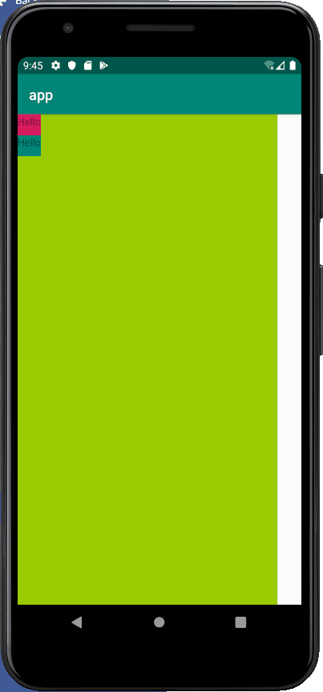
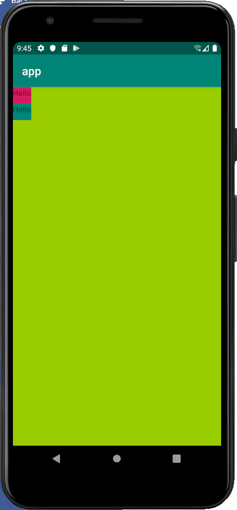
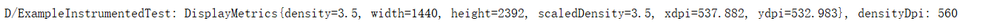
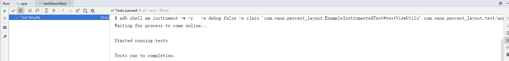
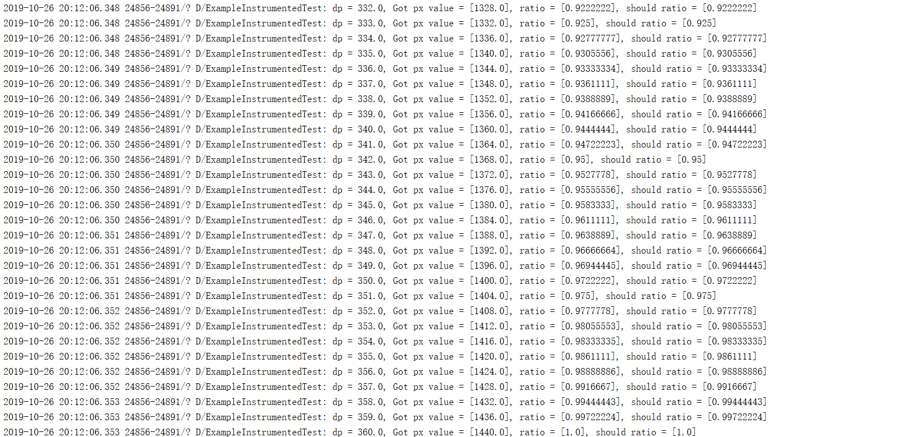

## 简介
DpAdapter 是一个致力于解决 Android UI 尺寸适配问题的框架

## 效果

设计稿的屏幕宽度为 360 dp。native 布局：

```xml
<?xml version="1.0" encoding="utf-8"?>
<FrameLayout xmlns:android="http://schemas.android.com/apk/res/android"
    xmlns:tools="http://schemas.android.com/tools"
    android:layout_width="360dp"
    android:layout_height="match_parent"
    android:background="@android:color/holo_green_light"
    tools:context=".MainActivity">

    <LinearLayout
        android:layout_width="wrap_content"
        android:layout_height="wrap_content"
        android:orientation="vertical">

        <TextView
            android:layout_width="wrap_content"
            android:layout_height="wrap_content"
            android:background="@color/colorAccent"
            android:text="Hello" />

        <TextView
            android:layout_width="wrap_content"
            android:layout_height="wrap_content"
            android:background="@color/colorPrimary"
            android:text="Hello" />
    </LinearLayout>

</FrameLayout>
```

针对 native 布局，适配前：



适配后：



使用 `ViewUtils` 类动态将 `dp` 转换为 `px`，设计稿的屏幕宽度为 `360dp`，采用 `Google Pixel XL` 进行测试。

单元测试结果：

```java
@Test
public void getScreenSizeInfo() {
    Context context = InstrumentationRegistry.getInstrumentation().getContext();
    DisplayMetrics metrics = context.getResources().getDisplayMetrics();
    Log.d(TAG, metrics.toString() + ", densityDpi: " + metrics.densityDpi);
}
```



该机型的宽度为` width / density = 1440 / 3.5 = 411dp `，使用 `ViewUtils` 类将 `dp` 转换为 `px`，单元测试代码：

```java
@Test
public void testViewUtils() {
    Context context = InstrumentationRegistry.getInstrumentation().getContext();
    ViewUtils.init(context);
    float matchWidthValue;
    // 设计稿的屏幕宽度为 360dp
    int designerScreenWidth = 360;
    int screenWidth = context.getResources().getDisplayMetrics().widthPixels;
    for (float i = 1; i <= designerScreenWidth; i++) {
        matchWidthValue = (int) ViewUtils.dp2px(i);
        Log.d(TAG, "dp = " + i + ", Got px value = [" + matchWidthValue + "], ratio = [" +
              (matchWidthValue / screenWidth) + "], should ratio = [" + (i / designerScreenWidth) + "]");
        if (Math.abs(i / designerScreenWidth - matchWidthValue / screenWidth) >= 0.00001) {
            throw new IllegalStateException();
        }
    }
}
```

测试结果：



